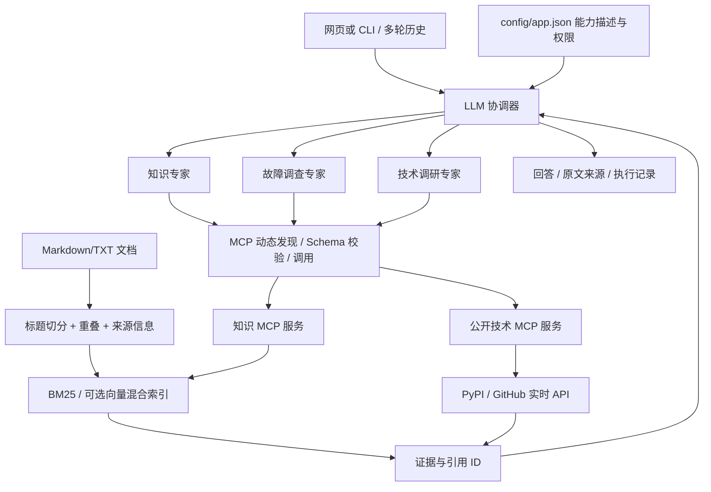

# 知维 OpsAtlas

一个软件运维与故障排查助手：**LLM 选择专家 Agent → 专家动态发现并调用 MCP 工具 → 检索专有知识与实时公开资料 → 带来源回答**。

从旅行示例重新设计的新项目，不包含城市名单、固定天气、固定票务或关键词意图路由。适合展示 Agent 编排、真实 MCP、文档知识单元、RAG 和可观察执行；并非已部署的生产运维平台。

> 内置 8 篇知识文档由 AI 预生成，属于虚构“星河工单平台”演练材料，切分为 32 个知识单元。它们不是实际企业规范，也不是权威技术资料。没有模型配置时只提供原文检索，不用规则模型假装智能回答。

## 能做什么

- **内部知识问答**：例如“连接池耗尽先查哪些证据”，检索章节并展示文件、原文位置、来源类型和引用。
- **故障调查**：例如“发布后出现 502，该补哪些日志，什么情况下不能直接回滚”，结合知识提出待验证假设，不伪造根因。
- **实时技术查询**：通过真实 PyPI / GitHub 公共 API 查询任意符合接口格式的包或公开仓库。对象不存在、限流和断网会真实失败，没有预设成功数据。
- **组合任务**：例如“查 httpx 当前版本，再结合内部连接池手册列一份升级验证清单”，协调器可以选择多个专家并汇总证据。
- **普通对话**：一般概念可直接解释；需要专门能力时模型按描述委派，无固定关键词分类器。

当前实时工具提供元数据，不是全网搜索、漏洞扫描、服务健康检查或生产集群操作。Agent 是应用进程中的独立角色与工具循环，不是独立 A2A 服务；MCP 服务通过真实 stdio 子进程通信。

## 快速运行

Python 3.12，Windows PowerShell：

```powershell
git clone https://github.com/Mysarff/new-agent.git
cd new-agent
python -m venv .venv
.venv/Scripts/python -m pip install -r requirements.txt
Copy-Item .env.example .env
.venv/Scripts/python -m opsatlas.cli ingest
.venv/Scripts/python -m streamlit run app.py --server.address 127.0.0.1
```

浏览器打开 `http://127.0.0.1:8501`。Linux/macOS 使用 `.venv/bin/python`，复制配置用 `cp .env.example .env`。页面默认无密钥检索；索引不存在时自动建立本地 BM25 索引。按 Ctrl+C 结束页面服务。

### 启用真实 Agent

在 `.env` 填自己的兼容接口，模型必须支持 Chat Completions `tools` / `tool_calls`：

```dotenv
AGENT_BASE_URL=https://your-provider.example/v1
AGENT_API_KEY=your-own-key
AGENT_MODEL=your-function-calling-model
```

上述是占位配置，不是可访问的模型服务。之后重启页面，选择“Agent 对话”。也可以：

```powershell
.venv/Scripts/python -m opsatlas.cli chat "查 httpx 当前版本，再检索连接池耗尽的排查流程，分别标明出处。"
.venv/Scripts/python -m opsatlas.cli discover
```

Chat Completions 是这里选用的可替换接口格式，不保证所有声称兼容的提供商都支持相同工具能力。模型调用和可选 embedding 可能计费，默认最多 6 轮/角色、12 次总工具调用、3 次委派。没有 API Key 不会自动回退为假模型。

## 架构与代码入口



| 文件 | 职责 |
| --- | --- |
| `config/app.json` | Agent 描述、提示词、工具授权、MCP 服务与预算 |
| `opsatlas/engine.py` | 模型自主委派、多轮工具循环、证据汇总与引用存在性检查 |
| `opsatlas/mcp_client.py` | MCP 握手、分页发现工具、stdio/Streamable HTTP、Schema 校验 |
| `opsatlas/servers.py` | 知识检索及真实公开 API 工具 |
| `opsatlas/rag.py` | 切分、稳定知识ID、索引快照、BM25、向量检索与 RRF |
| `opsatlas/model.py` | 可替换模型与 embedding 接口 |
| `app.py` | 多轮对话、原文查看、工具记录和重建索引 |
| `tests/` / `opsatlas/verify.py` | 自动化验证及小型检索检查 |

## “不写死”具体指什么

1. **业务路由不写死**：协调器看到的是配置生成的专家工具描述；模型选择专家。没有 `if 天气/数据库/城市` 的路由链。
2. **工具不手工复制到路由器**：每次对话启动时从可信 MCP 服务 `list_tools` 读取名称、说明和参数。只要权限模式匹配，新工具无需改引擎代码。
3. **知识不写进回答模板**：问题在文档索引中检索，结果进入模型上下文；更换领域时替换文档、Agent 提示词及必要工具即可。
4. **保留软件约束**：参数格式、端点配置、权限范围、预算及异常处理是必要控制，不属于把业务答案写死。新增真正的新能力仍需实现相应工具，不能凭配置凭空获得能力。

增加 Agent：在 `agents` 数组增加唯一 `id`、`description`、`prompt` 和工具模式 `tools`。模式如 `knowledge__*` 是权限范围，不是意图匹配。权限变更由项目维护者设置，模型无权修改。

增加 MCP 服务：在 `mcp_servers` 中配置可信服务。stdio 使用 `command` 和 `args`；HTTP 使用 `transport: "streamable_http"` 与 `url`，可通过 `headers_from_env` 映射授权头环境变量。`{python}` 表示当前解释器。默认内置服务均只读；此版本只接入维护者标记 `read_only: true` 的服务，发现显式 `readOnlyHint: false` 的工具会跳过。声明本身不是安全沙箱，不能把不可信服务随意标成只读。

服务配置是管理员代码信任边界，不接收聊天用户提供的服务地址或可执行命令。未实现写工具的完整审批工作流、多租户认证和生产变更执行。

## 知识单元与 RAG

将 Markdown / TXT 放入 `knowledge/` 后运行 `python -m opsatlas.cli ingest`。程序按标题分节、长节滑窗切分，默认 650 字符、100 字符重叠，保留 `source/title/heading/start/end/metadata`，知识 ID 基于文件、位置和内容生成。

支持文档头元数据：

```html
<!-- metadata: {"provenance":"user_supplied_unverified","version":"1.0","scope":"你的领域","review_status":"unreviewed"} -->
```

资料应由领域负责人核实后再修改审核状态；模型生成不等于审核。未提供元数据的文件自动标为未经核实的用户资料。上传真实内部资料前应评估模型提供商的数据使用政策，因为命中文本会发送给配置的模型服务。

默认 BM25 可离线运行，包含中文单字/双字词项和英文术语。**BM25 是词法检索，并非向量语义检索。** RAG 不强制必须用向量；Agent 模式将检索原文交给模型生成，才构成完整检索增强回答。

要启用真实向量混合检索，在 `.env` 配置：

```dotenv
EMBEDDING_BASE_URL=https://your-provider.example/v1
EMBEDDING_API_KEY=your-own-key
EMBEDDING_MODEL=your-embedding-model
```

运行 `python -m opsatlas.cli ingest --dense`。文档向量与查询向量使用相同提供商/模型，余弦相似度结果与 BM25 用 RRF 融合。换 embedding 提供商、模型或维度需要重建；不会悄悄用不兼容向量。索引使用本地 JSON 和 NumPy，面向小型知识库，不宣称是大规模向量数据库。

索引构建采用原子替换；空资料或 embedding 失败保留原索引。查询时检测文件增删改，发现变化明确要求重建，避免悄悄使用旧知识。CLI 或页面重建后后续查询读取新快照。不要在写入资料未完成时并发重建索引。

引用会核对 ID 是否来自本轮真实返回的证据；虚构 ID 被标记。但**引用存在不等于内容支持全部结论**，当前没有自动语义蕴含验证。检索分数不是置信度；词法无命中返回无证据，命中相关性和是否足以回答仍由模型判断，页面保留原文供核对。

## 验证与边界

```powershell
python -m opsatlas.verify
python -m opsatlas.verify --live-tools
```

第一条验证切分与位置、索引更新、向量接口故障、动态 Agent、工具权限、预算、引用、会话隔离、真实本地 MCP 和页面。模型与向量单元测试使用明确命名的测试夹具，**不是实际 LLM/embedding 效果评测**。`reports/verification.json` 记录结果。

12 个作者编写的查询只检查合成文档的文档级 Hit@3，数据少、与资料用词接近、有设计者偏差，不能当成外部泛化成绩。真实模型效果、语义改写召回和提示注入鲁棒性需要独立标注数据进一步评测。

第二条经真实 MCP 请求外部 API，结果保存在 `reports/live_tools.json`。公开接口可能限流或不可用；工具错误不会变成成功数据。本地已验证状态见报告，GitHub CI 见 [Actions](https://github.com/Mysarff/new-agent/actions)。未配置真实模型或 embedding 的验证会明确标记未测。Docker 配置已提供，但未做容器构建实测。

默认仅用于本机或可信私有环境。页面没有账户认证、文档 ACL 或跨用户隔离；每个页面会话的对话隔离，但知识库和索引共享。MCP 服务不可达时当前整轮启动会失败，不声称部分服务故障下仍可完整工作。

## 技术依据

- [MCP Python SDK v1.18.0](https://github.com/modelcontextprotocol/python-sdk/tree/v1.18.0)：本项目锁定的 MCP 版本及客户端/服务端接口。
- [模型工具调用格式](https://developers.openai.com/api/docs/guides/function-calling)：模型提出调用，应用校验执行，再返回结果。
- [PyPI JSON API](https://docs.pypi.org/api/json/) 与 [GitHub 仓库 API](https://docs.github.com/en/rest/repos/repos#get-a-repository)：公开技术数据来源。

本地旧 TripWeave 项目保留作历史对照，新仓库独立实现，没有复制课程密钥、数据库、日志或虚拟环境。
