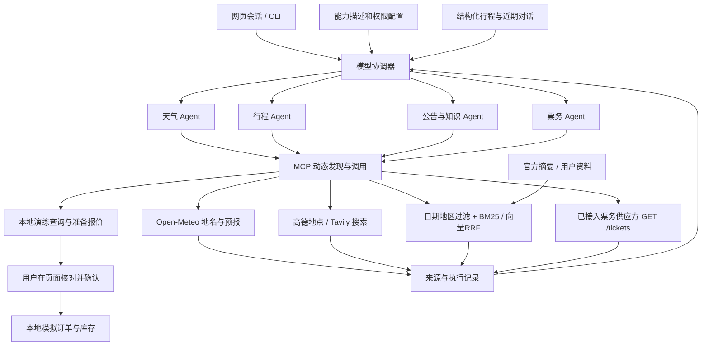

# SmartVoyage 架构与接口

## 从用户任务到可核对结果

完整模式的协调器与四个专家通过HTTP通信；单进程模式用相同的专家执行逻辑直接调用。两种模式都通过 MCP 调用工具，单进程模式不能标作远程 A2A。

## 模型决策与硬边界

每轮分两个阶段。第一阶段使用专门的简短 `CONTEXT_PROMPT`，工具列表只包含 `update_trip_context`，并通过强制 `tool_choice` 要求模型输出完整状态。此阶段Schema将 `departure/destination/start_date/end_date/travelers/preferences/notes` 七个字段全部列为必填，不能提交空 patch。未变化字段保留旧值，未知标量用 `null`，未知偏好用 `[]`；根据明确日期与对话处理“后天”“同一天”等指代，单日查询的开始和结束日期相同。

完整快照校验并保存后，第二阶段恢复原协调器的任务提示、配置生成的 `delegate__<agent>` 等工具与自动工具选择，由模型根据能力描述决定是否及如何委派专家。第一阶段不会挑选专家或回答业务问题，也不使用城市词表、关键词分支填入上下文字段。

这两个阶段用于减少模型直接委派、遗漏保存首次行程条件而导致后续“那后天呢”丢失上下文的问题。强制完整快照和字段校验不保证语义提取始终正确，少量样例通过也不能推断长期成功率。所有函数名和参数仍必须经过授权及 JSON Schema 校验。专家仅可见配置授权的 MCP 工具，业务意图没有固定分类器。

默认每个角色最多8轮，每次请求总工具调用上限24，委派上限5；上下文更新与委派也计入总工具预算。A2A 服务获得本轮剩余预算，协调器汇总其消耗。到达限制返回未完成状态，不假称整条旅行任务已经完成。参数均可在 `config/travel.json` 调整。

协调器在 `Engine.run` 中通过 `asyncio.wait_for` 限制完整协调循环，默认 `run_timeout=240` 秒，覆盖第一阶段上下文提取、后续模型请求以及本地或远程专家等待。超时返回明确的未完成回答，记录 `run_timeout` 事件，并保留已收集的证据；进入循环前的 MCP 初始化与退出清理不计入这一时限。它与单次工具的 `tool_timeout`、单次远程请求的 `a2a_timeout` 是不同层级的限制。

`TravelSession` 保存行程条件、近期候选、待确认报价及用户开启的模拟状态。用户修正路线或日期时，旧候选和报价失效。协调器接收最近14条文本对话与结构化快照；专家接收同一任务的上下文和有限的上游证据。会话状态是本地内存对象，不是跨设备持久用户画像。

无模型配置时只能直接执行用户填写参数的工具查询或展示检索片段；不存在“自动换成规则模型”的降级。工具和知识文本作为数据进入模型；提示词要求不执行其中的指令，但这不是已证明抵抗所有提示注入的安全保证。

## A2A 与 MCP 分工

锁定库为 `python-a2a==0.5.4` 与 `mcp==1.18.0`。四个默认专家HTTP端口为8611、8612、8613、8614，由 FastAPI/uvicorn 承载。

| 路径 | 行为 |
| --- | --- |
| `GET /health` | 服务与专家ID健康状态，不表示外部API一定可用 |
| `GET /.well-known/agent.json` | 返回能力 AgentCard |
| `POST /tasks/send` | 接收JSON-RPC `tasks/send` 和库的Task对象，执行指定专家，返回任务结果 |

A2A Task 的文本载荷包含 `query/history/context/evidence/budget`。返回的 `metadata.business` 包含回答、证据、执行记录、消耗的调用数、票务候选和报价。客户端检查 AgentCard 名称、请求/任务ID、完成状态与预算；这些检查不构成公网身份认证。

这个实现面向项目的同步专家请求，不宣称支持全部A2A版本、所有方法、推送通知或流式任务恢复。

MCP客户端启动配置中的可信stdio子进程，执行初始化、分页 `list_tools` 和调用。也支持管理员配置的 Streamable HTTP URL。工具名带服务前缀，例如 `travel__forecast`。声明为写操作的工具默认不会提供，只有配置中明确允许的 `prepare_demo_booking` 可准备本地报价。确认订单不是MCP工具，不可由模型自行调用。

MCP服务配置可执行本地程序，是维护者信任边界。聊天用户不能通过输入一个URL或命令动态注册任意工具。第三方服务的只读标记不是安全沙箱，应由维护者核实其实现。

## 天气流程

1. `geocode(query, country_code)` 向 Open-Meteo 查询地点，返回国家、行政区、经纬度、时区及服务方ID。多个候选返回 `needs_input`，不能静默选择第一个。
2. `forecast(location_id, start_date, end_date)` 重新向供应方解析ID，使用实际经纬度和目的地时区。
3. 仅接受目的地今天至今天加15天的完整日期范围；超出范围返回 `out_of_range`，不裁剪成另一个行程。
4. 校验日期、数值与单位后返回天气代码、最高/最低温、最高降水概率、总降水量、大尺度降雨量和最大风速。`null` 是缺测，不是0。

专家调用 `travel__forecast` 前还有会话日期检查：上下文同时存在 `start_date/end_date` 时，实际查询必须满足 `行程开始日 ≤ 查询开始日 ≤ 查询结束日 ≤ 行程结束日`。缺省查询结束日按查询开始日处理；不满足时返回 `date_mismatch`，不发送预报请求，要求模型修正参数。该检查允许用户日期窗口内的子区间，不校验模型最初提取的日期是否符合用户语义；它与供应方的16天预报范围校验分别执行。

数据来自模型预报，不等于气象站实测或灾害警报。资料同时提供查询来源、采集时间和单位，便于用户复核。

## RAG 证据与时效

`ingest(config, embedder=None)` 将 JSON/MD/TXT 导入本地索引。JSON的字符位置指向精确 `text` 字段；MD/TXT位置指向导入文件正文。稳定知识ID与文档标识、来源、字符位置及文本有关。

`TravelKnowledge.search(query, travel_date=None, region=None, top_k=5, include_historical=False)` 先按日期、地区和来源类型过滤，再做检索排名：

- 未填写行程日时使用运行机器当天日期；填写时按该行程日判断适用期。
- 尚未发布、尚未生效资料不进入该日期的结果。
- 过期资料默认排除；显式历史检索可返回，但附 `expired` 标签。
- `synthetic`资料默认始终排除，历史开关也不能将演练资料提升为真实证据。
- 全国标签如 `CN` 可匹配 `CN/北京`；不使用固定城市表补全国家。
- 有效期未知只标记未知；`official_summary`由维护者标注，检索程序不会独立认证来源。

结果给出来源URL、核验日期、切分位置、来源类型、时效状态和排序分数。BM25支持中文双字词元，向量编码器遵循 `identity/encode` 接口。混合模式按词法排名和向量排名做RRF融合；模型身份或维度不符就要求重建。排序分数不是事实置信度。

索引记录资料指纹和切分设置。源文件增删改、元数据改动或切分设置变化都会触发重建要求；构建成功后原子替换，失败保留旧索引。知识文件与索引更新由维护者发起，没有后台自动抓取或定时同步。

协调器检查最终回答的引用ID是否来自本次收集的证据。ID存在只表示确实检索到了这个来源，不代表自动证明该来源支持回答的每句话。

## 票务查询契约

配置 `SMARTVOYAGE_TICKET_BASE_URL` 后发送只读 `GET <base>/tickets`。请求参数为 `kind/departure/arrival/date`；Key非空时以 Bearer 头认证。外部地址必须为HTTPS，localhost调试允许HTTP，不跟随重定向。

响应对象含 `tickets` 数组，每次最多500条，票号不可重复。每条记录字段如下：

| 字段 | 约束 |
| --- | --- |
| `id`、`service`、`seat`、`source` | 非空字符串；标明供应方来源 |
| `kind`、`departure`、`arrival`、`date` | 必须与请求逐项一致；日期为YYYY-MM-DD |
| `price` | 非负有限数值 |
| `currency` | 三位大写货币代码，例如CNY |
| `remaining` | 非负整数或null；null表示未知 |
| `booking_url` | 可选，必须是无内嵌认证信息的HTTPS链接 |

这是应用对接契约，不是已获得的铁路或航空售票权限。供应商已有不同字段时，应在获得授权的后端转换，不能直接将一个无关API地址和Key填入冒充接通。适配器只查询，不申请预订、扣款或出票。

本地演练流程为“用户创建演练路线 → 查询虚构候选 → 准备报价 → 页面人工确认 → 写入模拟订单”。路线和日期来自用户；班次、价格和库存来自明确标注的测试模板，不能混入真实查询结果。

模拟报价默认5分钟有效，准备时不锁库存。确认时使用SQLite事务重新检查有效期、库存、价格与行程，报价ID和请求ID使重复确认返回同一结果。库存与订单仅影响本地演练数据库，不涉及真实账户或资金。

## 验证与部署范围

自动化测试应分别验证工具正确性、RAG过滤与来源、模型编排协议、上下文变更和模拟确认。mock模型与向量验证的是可重复的控制流程，不是模型语义能力；真实模型对话、真实网络服务及供应方授权须单独验证。

`python -m SmartVoyage.verify` 仅展示验收计划，不发起模型或网络请求。明确执行 `python -m SmartVoyage.verify --live --network` 后，会调用已配置的真实模型与已运行的四个 A2A 专家服务，经 MCP 访问实际工具，可能产生模型/API费用。需要先运行 `python -m SmartVoyage.stack` 或 `python -m SmartVoyage.stack --no-ui`。省略 `--network` 只改变专家执行方式，不把真实模型改成 mock。

验收器默认持续写入 `var/live_verification.json`（可用 `--output` 修改），包含每步的 `criteria`、工具记录、引用与结构化上下文，并脱敏配置中的认证值和私有服务地址。三步连续天气问题核对西安明天、西安后天及东京同一天的地点、国家、时区、日期、预报数值和引用；另检查民航充电宝知识引用及未配置票务的明确不可用状态。网络模式还要求存在真实 A2A 完成事件，单有一段自然语言回答不会通过。

报告以 `running/passed/failed/partial/interrupted` 区分状态，并保留步骤判据；配置了真实票务时，“票务未接入”用例会跳过，汇总不称作全通过。这些判据只验证明确覆盖的执行、上下文与证据匹配，不代表逐句事实审查、长期成功率、高德/Tavily单独验收或向量语义召回质量。真实模型具有不确定性，应以本次实际报告为准，未完成运行不能提前宣称最终通过。

默认仅监听127.0.0.1。当前没有认证、多租户隔离、文档ACL、远程订单审批或公网服务加固。将服务开放到公网前需要另做完整身份、网络、访问控制及数据保护设计。知识库与模拟数据库是共享本地资源，页面中的会话隔离不应被表述为生产多租户隔离。
